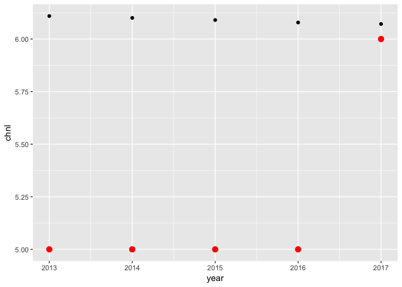
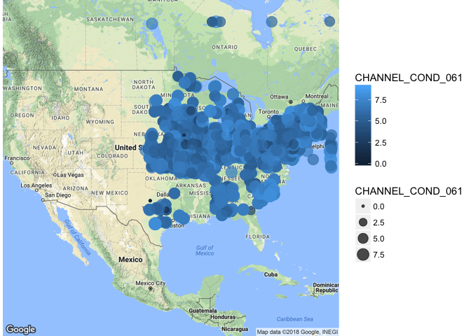
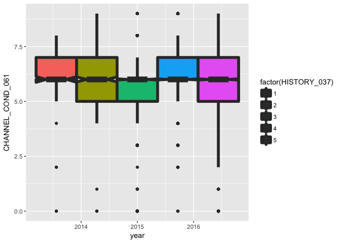

Bridges
================

### Bridges of the USA.

[I think this data is so interesting.](https://www.fhwa.dot.gov/bridge/nbi/ascii.cfm) When you find some data, you should always look for the [data descriptions](https://www.fhwa.dot.gov/bridge/mtguide.pdf). From page 38, we have the ratings of bridge conditions (for Deck, Superstructure, and Substructure), for *every bridge in the US*, for every year back to 1991. Lots of other data on each bridge (e.g. county FIPS code of the bridge).

Warm up: make a file with bridge ID, year, fips codes, condition ratings, and a few other variables that interest you. Make your code reproducible. Make a plot. Things to do first: (i) look at a few lines of the raw data, (ii) look at the data description. Work independently, in small groups. (Share ideas and functions, but not code)

Project idea: zoom into a subset of "interesting" bridges (as you define it). Track how those bridges have changed over time. Make an interactive visualization that helps you tell a story. This project is definitely not required. It is just to help give a slightly more concrete example to the question "what do you expect in a project?".

``` r
#echo=FALSE,message=FALSE, warning=FALSE, error=FALSE}
library(data.table)
z <- fread("bridgedata.csv")
```

    ## 
    Read 0.8% of 3615816 rows
    Read 12.2% of 3615816 rows
    Read 19.6% of 3615816 rows
    Read 32.4% of 3615816 rows
    Read 44.0% of 3615816 rows
    Read 58.4% of 3615816 rows
    Read 77.2% of 3615816 rows
    Read 96.0% of 3615816 rows
    Read 3615816 rows and 36 (of 36) columns from 0.493 GB file in 00:00:11

``` r
table(z$STATE_CODE_001)
```

    ## 
    ##      1      2      4      5      6      8      9     10     11     12 
    ##  87778   7858  47418  72759 174227  48851  27508   5972   2006  82573 
    ##     13     15     16     17     18     19     20     21     22     23 
    ##  86786   6037  24316 153919 112825 128349 132284  82246  70970  14411 
    ##     24     25     26     27     28     29     30     31     32     33 
    ##  32873  28910  72232  79314  92393 139984  29501  80809  11679  19792 
    ##     34     35     36     37     38     39     40     41     42     44 
    ##  48929  23313 113571 111482  24675 163817 127439  46035 148832   5630 
    ##     45     46     47     48     49     50     51     53     54     55 
    ##  52083  31921 116383 315288  19849  15386  87715  46652  43546  85020 
    ##     56     72 
    ##  17339  14331

``` r
table(z$DECK_COND_058)
```

    ## 
    ##             0      1      2      3      4      5      6      7      8 
    ## 547491   4462    922   2732  15012  73509 289794 563056 952975 378768 
    ##      9      N 
    ##  70328 716767

``` r
table(z$SUBSTRUCTURE_COND_060)
```

    ## 
    ##             0      1      2      3      4      5      6      7      8 
    ## 547492   4433   1631   7848  26370 100834 304597 543821 896790 416764 
    ##      9      N 
    ##  74078 691158

``` r
table(z$SUPERSTRUCTURE_COND_059)
```

    ## 
    ##             0      1      2      3      4      5      6      7      8 
    ## 547491   4568   1387   3760  18478  80854 285254 530960 856884 511005 
    ##      9      N 
    ##  84543 690632

``` r
table(z$CHANNEL_COND_061)
```

    ## 
    ##             0      1      2      3      4      5      6      7      8 
    ## 547489   1695    221    716   8438  66724 286269 695559 883918 527266 
    ##      9      N 
    ##  74059 523462

``` r
table(z$CULVERT_COND_062)
```

    ## 
    ##               0       1       2       3       4       5       6       7 
    ##  547408     129      67     560    3223   10816   58185  188155  302590 
    ##       8       9       N 
    ##  108446   17555 2378682

``` r
table(z$YEAR_BUILT_027)
```

    ## 
    ##    19  1697  1764  1765  1777  1789  1792  1796  1798  1800  1801  1804 
    ##     2     5     5     5     5     5    10     5    10     9     9    10 
    ##  1805  1807  1809  1810  1812  1817  1820  1822  1823  1824  1825  1826 
    ##     5     5     5    20     5    10    22    15     5    25    25    20 
    ##  1827  1828  1829  1830  1831  1832  1833  1834  1835  1836  1837  1838 
    ##    25    18    10    30     8   163    25    19    13    20    15    15 
    ##  1839  1840  1841  1842  1844  1845  1846  1847  1848  1849  1850  1851 
    ##    35    66    60    25    10    20    10    31    15    43   552    14 
    ##  1852  1853  1854  1855  1856  1857  1858  1859  1860  1861  1862  1863 
    ##    41    53    50    42    45    26    50     7   161    35    36    32 
    ##  1864  1865  1866  1867  1868  1869  1870  1871  1872  1873  1874  1875 
    ##    25    75    15    73    48    72   175    89    78    88    97   186 
    ##  1876  1877  1878  1879  1880  1881  1882  1883  1884  1885  1886  1887 
    ##   143   116   104    76   302    90   130   201   157   306   232   329 
    ##  1888  1889  1890  1891  1892  1893  1894  1895  1896  1897  1898  1899 
    ##   232   366   778   252   294   271   270   502   395   370   328   442 
    ##  1900  1901  1902  1903  1904  1905  1906  1907  1908  1909  1910  1911 
    ## 25553  1779   841   834  1111  2043  1258  1477  1652  3168  7307  2200 
    ##  1912  1913  1914  1915  1916  1917  1918  1919  1920  1921  1922  1923 
    ##  2425  2342  3078  5683  3046  2822  2884  3465 16638  4476  5547  5406 
    ##  1924  1925  1926  1927  1928  1929  1930  1931  1932  1933  1934  1935 
    ##  6627 14705  8817  9779 13473 14096 43827 16053 22355 12291 14949 39478 
    ##  1936  1937  1938  1939  1940  1941  1942  1943  1944  1945  1946  1947 
    ## 20306 17697 23270 21446 44985 14427  8472  3550  2713  9082  7896 13520 
    ##  1948  1949  1950  1951  1952  1953  1954  1955  1956  1957  1958  1959 
    ## 19085 18456 49858 19530 23716 26340 34215 41317 40594 40372 54345 53414 
    ##  1960  1961  1962  1963  1964  1965  1966  1967  1968  1969  1970  1971 
    ## 81185 51819 59522 66339 64755 82580 63280 63988 67471 58390 78477 54109 
    ##  1972  1973  1974  1975  1976  1977  1978  1979  1980  1981  1982  1983 
    ## 56452 50324 49450 56876 47625 40711 42915 39535 46746 38573 37243 41263 
    ##  1984  1985  1986  1987  1988  1989  1990  1991  1992  1993  1994  1995 
    ## 46790 47116 46444 48042 50306 47961 53670 49151 47187 45772 45042 44650 
    ##  1996  1997  1998  1999  2000  2001  2002  2003  2004  2005  2006  2007 
    ## 45436 45697 43533 46250 47127 43389 44518 45033 44101 42058 42499 36819 
    ##  2008  2009  2010  2011  2012  2013  2014  2015  2016  2017  2024  2032 
    ## 36844 35435 35538 33592 34256 25006 17061 10074  4519   227     8     2

``` r
library(ggplot2)
library(devtools)
library(ggmap)
newz <- na.omit(z)
library(dplyr)

newz$DECK_COND_058[newz$DECK_COND_058 %in% "N"] <- NA
class(newz$DECK_COND_058)
```

    ## [1] "character"

``` r
newz$DECK_COND_058 <- as.numeric(newz$DECK_COND_058)

newz$CHANNEL_COND_061[newz$CHANNEL_COND_061 %in% "N"] <- NA
class(newz$CHANNEL_COND_061)
```

    ## [1] "character"

``` r
newz$CHANNEL_COND_061 <- as.numeric(newz$CHANNEL_COND_061)

newz$CULVERT_COND_062[newz$CULVERT_COND_062 %in% "N"] <- NA
class(newz$CULVERT_COND_062)
```

    ## [1] "character"

``` r
newz$CULVERT_COND_062 <- as.numeric(newz$CULVERT_COND_062)

newz$SUPERSTRUCTURE_COND_059[newz$SUPERSTRUCTURE_COND_059 %in% "N"] <- NA
class(newz$SUPERSTRUCTURE_COND_059)
```

    ## [1] "character"

``` r
newz$SUPERSTRUCTURE_COND_059 <- as.numeric(newz$SUPERSTRUCTURE_COND_059)

newz$SUBSTRUCTURE_COND_060[newz$SUBSTRUCTURE_COND_060 %in% "N"] <- NA
class(newz$SUBSTRUCTURE_COND_060)
```

    ## [1] "character"

``` r
newz$SUBSTRUCTURE_COND_060 <- as.numeric(newz$SUBSTRUCTURE_COND_060)

newz$STRUCTURE_NUMBER_008 <- as.numeric(newz$STRUCTURE_NUMBER_008)
```

    ## Warning: NAs introduced by coercion

``` r
class(newz$STRUCTURE_NUMBER_008)
```

    ## [1] "numeric"

``` r
fgbid <- newz %>% 
  group_by(STRUCTURE_NUMBER_008) %>% 
  summarise(deckcond = mean(DECK_COND_058, na.rm = TRUE),
    n = n())
f1900 <- newz %>% 
  filter(YEAR_BUILT_027 == 1900)
f4 <- f1900 %>%
  filter(STRUCTURE_NUMBER_008 == 4, STATE_CODE_001 == 45) 
f1900m <- f1900 %>% 
  group_by(year) %>% 
  summarise(chnl = mean(CHANNEL_COND_061, na.rm = TRUE),
    n = n())

library(ggvis)
```

    ## 
    ## Attaching package: 'ggvis'

    ## The following object is masked from 'package:ggplot2':
    ## 
    ##     resolution

``` r
f4 %>%
ggvis( x = ~year, y = ~CHANNEL_COND_061, fill := "red" ,size := input_slider(100,500), opacity := 0.3 ) %>%
layer_points()
```

    ## Warning: Can't output dynamic/interactive ggvis plots in a knitr document.
    ## Generating a static (non-dynamic, non-interactive) version of the plot.

<!--html_preserve-->

<nav class="ggvis-control"> <a class="ggvis-dropdown-toggle" title="Controls" onclick="return false;"></a>
<ul class="ggvis-dropdown">
<li>
Renderer: <a id="plot_id833649052_renderer_svg" class="ggvis-renderer-button" onclick="return false;" data-plot-id="plot_id833649052" data-renderer="svg">SVG</a> | <a id="plot_id833649052_renderer_canvas" class="ggvis-renderer-button" onclick="return false;" data-plot-id="plot_id833649052" data-renderer="canvas">Canvas</a>
</li>
<li>
<a id="plot_id833649052_download" class="ggvis-download" data-plot-id="plot_id833649052">Download</a>
</li>
</ul>
</nav>

<script type="text/javascript">
var plot_id833649052_spec = {
  "data": [
    {
      "name": ".0",
      "format": {
        "type": "csv",
        "parse": {
          "year": "number",
          "CHANNEL_COND_061": "number",
          "reactive_976774021": "number"
        }
      },
      "values": "\"year\",\"CHANNEL_COND_061\",\"reactive_976774021\"\n2013,5,300\n2014,5,300\n2015,5,300\n2016,5,300\n2017,6,300"
    },
    {
      "name": "scale/x",
      "format": {
        "type": "csv",
        "parse": {
          "domain": "number"
        }
      },
      "values": "\"domain\"\n2012.8\n2017.2"
    },
    {
      "name": "scale/y",
      "format": {
        "type": "csv",
        "parse": {
          "domain": "number"
        }
      },
      "values": "\"domain\"\n4.95\n6.05"
    }
  ],
  "scales": [
    {
      "name": "x",
      "domain": {
        "data": "scale/x",
        "field": "data.domain"
      },
      "zero": false,
      "nice": false,
      "clamp": false,
      "range": "width"
    },
    {
      "name": "y",
      "domain": {
        "data": "scale/y",
        "field": "data.domain"
      },
      "zero": false,
      "nice": false,
      "clamp": false,
      "range": "height"
    }
  ],
  "marks": [
    {
      "type": "symbol",
      "properties": {
        "update": {
          "x": {
            "scale": "x",
            "field": "data.year"
          },
          "y": {
            "scale": "y",
            "field": "data.CHANNEL_COND_061"
          },
          "fill": {
            "value": "red"
          },
          "size": {
            "field": "data.reactive_976774021"
          },
          "opacity": {
            "value": 0.3
          }
        },
        "ggvis": {
          "data": {
            "value": ".0"
          }
        }
      },
      "from": {
        "data": ".0"
      }
    }
  ],
  "legends": [],
  "axes": [
    {
      "type": "x",
      "scale": "x",
      "orient": "bottom",
      "layer": "back",
      "grid": true,
      "title": "year"
    },
    {
      "type": "y",
      "scale": "y",
      "orient": "left",
      "layer": "back",
      "grid": true,
      "title": "CHANNEL_COND_061"
    }
  ],
  "padding": null,
  "ggvis_opts": {
    "keep_aspect": false,
    "resizable": true,
    "padding": {},
    "duration": 250,
    "renderer": "svg",
    "hover_duration": 0,
    "width": 672,
    "height": 480
  },
  "handlers": null
};
ggvis.getPlot("plot_id833649052").parseSpec(plot_id833649052_spec);
</script>
<!--/html_preserve-->
``` r
ggplot() +
  geom_point(data = f1900m, aes(year, chnl)) +
  geom_point(data = f4, aes(year, CHANNEL_COND_061), colour = 'red', size = 3)
```



``` r
#library(rCharts)
#rPlot(CHANNEL_COND_061 ~ year , data = f1900, type = "point", color = "TRAFFIC_LANES_ON_028A") 
#nPlot(CHANNEL_COND_061 ~ year, group = "HISTORY_037", data = f4, type = "multiBarChart")
f1900$lon <- (f1900$LONG_017 / 10 ^ nchar(f1900$LONG_017) * 100)*(-1)
f1900$lat <- f1900$LAT_016 / 10 ^ nchar(f1900$LAT_016) * 100
ggmap(get_googlemap(center = 'the United States of America', zoom=4,maptype='terrain'),extent='device')+
  geom_point(data= f1900,aes(x=lon,y=lat,size=CHANNEL_COND_061,color=CHANNEL_COND_061),alpha=0.7)
```

    ## Map from URL : http://maps.googleapis.com/maps/api/staticmap?center=the+United+States+of+America&zoom=4&size=640x640&scale=2&maptype=terrain&sensor=false

    ## Information from URL : http://maps.googleapis.com/maps/api/geocode/json?address=the%20United%20States%20of%20America&sensor=false

    ## Warning: `panel.margin` is deprecated. Please use `panel.spacing` property
    ## instead

    ## Warning: Removed 1945 rows containing missing values (geom_point).



``` r
ggplot(data=f1900,aes(x=year,y=CHANNEL_COND_061,fill=factor(HISTORY_037)))+geom_boxplot(size =2,notch=T)
```

    ## Warning: Removed 777 rows containing non-finite values (stat_boxplot).

    ## notch went outside hinges. Try setting notch=FALSE.

    ## notch went outside hinges. Try setting notch=FALSE.
    ## notch went outside hinges. Try setting notch=FALSE.


